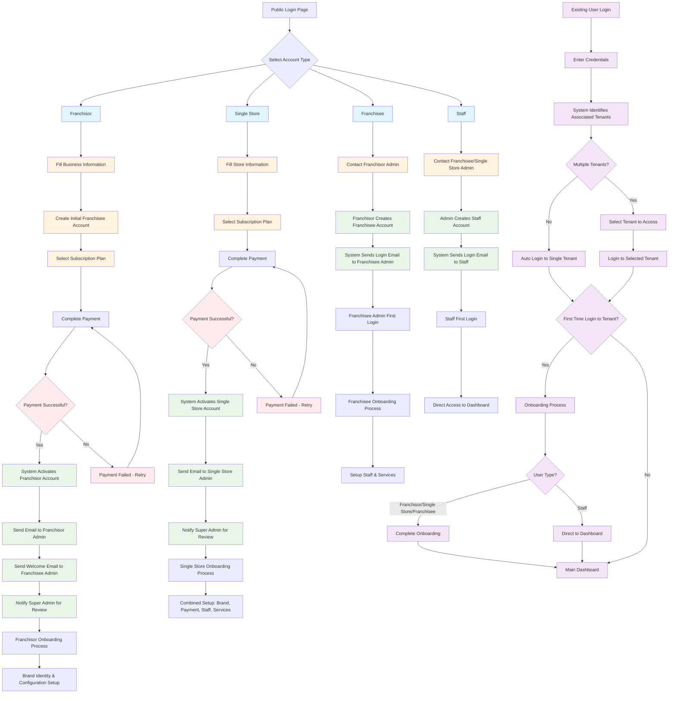

# Tenant Creation Flow Diagram

## Key Flow Points:

### New User Registration:
1. **Franchisor**: Self-registration → Business info → Create franchisee → Payment → Activation → Onboarding
2. **Single Store**: Self-registration → Store info → Payment → Activation → Combined onboarding
3. **Franchisee**: Cannot self-register → Must be created by franchisor → Email invitation → Onboarding
4. **Staff**: Cannot self-register → Must be created by admin → Email invitation → Direct dashboard access

### Existing User Login:
1. **Authentication** → **Tenant Detection** → **Tenant Selection** (if multiple) → **First-time vs. Regular Login** → **Appropriate Destination**

### System Notifications:
- Franchisor/Single Store: Email to admin + Super Admin notification
- Franchisee: Email to franchisee admin + Franchisor notification
- Staff: Email to staff member + Admin notification

### Onboarding Differences:
- **Franchisor**: Brand identity & configuration setup
- **Single Store**: Combined setup (brand, payment, staff, services)
- **Franchisee**: Staff & services setup
- **Staff**: No onboarding - direct dashboard access

